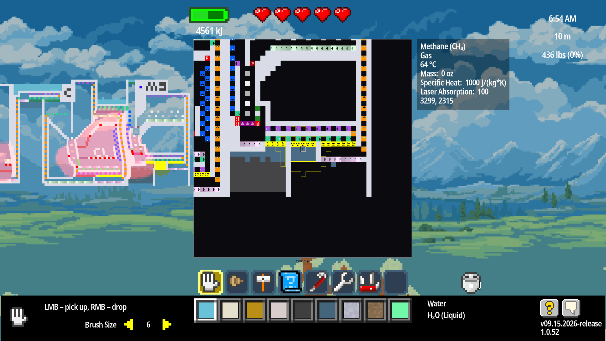
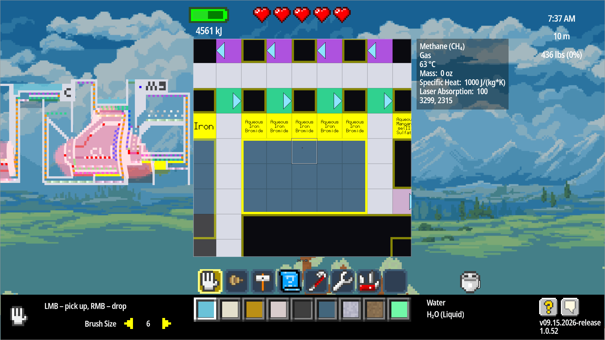

# Pixel Inspector

An Atomcraft mod that magnifies the world around your cursor when you hold **Alt**, adding details
to each configured pixel in the form of icons and text.

## Screenshots




## Interface

Hold **Alt**. A square panel in the middle of the screen will show the a zoomed in and annotated
view of the world pixels around your cursor.

**Alt -** and **Alt =** zoom the panel in and out.

## What it draws

The center of the panel has your cursor position with an outline and dot. The outline turns red
if your cursor is over a UI element that would capture a click.

Any tool highlight around your cursor appears as outlines in the inspector panel.

Mechanical pixels gain icon and/or text labels describing what they do and how they are configured.

### Specific annotations

| Mark | Meaning |
| --- | --- |
| A triangle on the cell's edge | which way it points: conveyors, pumps, guns, lasers, prisms, bullets, and the output side of a gate or latch |
| A second, faded triangle | the side a balancer takes *from*; the solid one is the side it gives to |
| A standard **gate outline** | And, Or, Xor or Not, turned to face the way the pixel does |
| A **two-gate latch**, one gate lit | which half is holding: the first while it waits for its input to rise, the second once it has fired and is holding until the input falls. Turned to face the way the pixel does |
| `Foo` on its own | a match filter set to Foo |
| A red **cross** over `Foo` | a nonmatch filter set to Foo |
| `?` over `Foo` | a sensor watching for Foo |
| A cross or `?` alone | a nonmatch filter or a sensor that has not been programmed yet |
| **Nothing at all** | among other things, a match filter that has not been programmed. See below |
| A name ending in `…` | the cell was too small to show all of it. Hover for the full name |
| A **square**, a **drop**, a **cloud** or a **person** | Allow Solids / Liquids / Gases / Players |
| The same with a red **cross** on it | Block Solids / Liquids / Gases |
| A monochrome **drop** | Water Filter or Block Water |
| `1227` `727` `2000` | a heating element's or a temperature sensor's setting, in whichever unit the game's own display setting names |
| `0` `150` `273` `275` | a cooling element's setting, in the same unit as a heating element's. The unnumbered one really is **0 K**: it sets every neighbour's heat to zero where the others clamp to their own value |
| `2` `3` `4` `5` | an oscillator's period, in the game's own "steps" of 60 ticks — a `3` pulses briefly once every 180 ticks |
| `2` `4` `8` | a dispenser's period, in ticks |
| `*` on a gun | loaded |
| everything dimmed | switched off |

## Install

1. Install [GodotMonoModLoader](https://github.com/sacroimper/GodotMonoModLoader).
2. Drop `PixelInspector.zip` **and [`PixelArt.zip`](https://github.com/sparr/atomcraft-mod-PixelArt)** into `<user data>/Mods/`. Do not extract either.
3. Launch with `-s GodotMonoModLoader.gd` (under Steam: `%command% -s GodotMonoModLoader.gd`).

Releases carry `SHA256SUMS` for the zips: `sha256sum -c SHA256SUMS` checks a download against it, and attests to what was uploaded rather than to a reproducible build.

## Settings

Written to `user://PixelInspector.json` the first time the mod runs, with a comment above each key, so the options are discoverable without reading this file. Delete it to restore the defaults.

| Key | Default | What it does |
| --- | --- | --- |
| `enabled` | `true` | `false` turns the whole mod off without uninstalling it |
| `requireAlt` | `true` | `false` annotates all the time instead of only while Alt is held. Worth having while building something, tiring the rest of the time |
| `worldMarks` | `false` | `true` also draws the arrows and shapes on the machines themselves, across the world, not only in the panel. Never text |
| `blockClicksOverUI` | `true` | Swallows a click made while the panel is up and the pointer is over interface that would take it — the case the panel marks with a thick red outline. Off leaves the warning and lets the click through |
| `quietCursor` | `true` | Hides the mouse cursor where the panel would be drawn over it. The panel says where you are pointing more precisely than the cursor did, so the cursor is only in the way there. Off leaves the cursor alone |
| `radius` | `6` | How many cells out from the cursor get **world marks**, when those are on. Does not affect the panel, whose size is the zoom |
| `debugOverlay` | `false` | Outlines the block being annotated and shows how many pixels it looked at. The quickest way to answer "is that radius the size I meant?" |
| `maxTextLength` | `0` | A ceiling on how much of a target name is ever shown, however much room the cell has; `0` means no ceiling. **Not** the cut length — the zoom decides that, every frame. Set it if you would rather have terser labels than your cells could hold |

Read once, at startup. Editing the file while the game is running does nothing until it restarts.

## Building and testing

```sh
cp harness.conf.example harness.conf   # then edit it
./build.sh                             # Debug, the everyday loop
./build.sh --release --install         # what a release is cut from
./run-tests.sh                         # the suite
./run-tests.sh --headful               # plus the three tests that judge what is on screen
./run-tests.sh --retirement            # instead: is the game still hiding what this shows?
./run-tests.sh --no-build              # test what is installed; how a release is verified
./play.sh                              # a real, playable game with only this mod
./play.sh --debug                      # ...with the diagnostic overlay switched on
./play.sh --verify                     # boot it headless and confirm it loaded
./release.sh 1.2.3                     # stage the zips and SHA256SUMS; publishes nothing
```

Tests run inside the real game through the [Atomcraft TestHarness](https://github.com/sparr/atomcraft-mod-TestHarness), against a patched *copy* of the install in a throwaway prefix. Your saves and your real game are never touched.

`harness.conf` names the pinned harness release. There are no path defaults on purpose: a path guessed from a sibling directory goes stale silently the first time that directory is renamed. This project does not build the harness and does not read its sources, so a mid-edit harness checkout cannot fail this project's tests.

Everything stays under a test root private to this project (`~/.cache/atomcraft-test-pixelinspector`), so a run here cannot disturb another project running against the same harness.

**Build releases with `--release`.** Debug is the default because that is what you want while working, but a Debug assembly carries `DebuggableAttribute` with `DisableOptimizations`, which turns the JIT off for it entirely, and this mod's pass runs on every frame Alt is held.

## Layout

| | |
| --- | --- |
| [src/](src/) | the mod &rarr; `build/PixelInspector.zip` |
| [test/](test/) | its tests &rarr; `build/PixelInspector.Test.zip` |
| [conformance/](conformance/) | properties of the game, naming no mod &rarr; `build/PixelInspectorConformance.zip` |
| [minimal/](minimal/) | the whole idea in one file, not built |
| [lib/](lib/) | shell helpers shared by the three scripts |
| `pixelart.conf` | which Pixel Art build this is pinned to, gitignored. See `pixelart.conf.example` |

The tests are a peer mod, not a module of this one: the loader treats a missing dependency as an error, so a test module shipped inside this zip would show a red entry in the loader report for every player who had not also installed `TestHarness`.

## Compatibility

Written against Atomcraft build **25333425** (`Atomcraft.dll` md5 `24bae9b4d904deb16b573d3279a5d3e1`), Pixel Art 0.4.0 and TestHarness 0.4.0.

## What it patches

| Target | Why |
| --- | --- |
| `Materials.Init` (postfix) | build the per-material table, after the shipped data, the user directory, and every other mod's materials |
| `Simulation.Init` / `Simulation.Reset` (postfix) | put the panel zoom back, so it lasts as long as a world and resets on the way to the menu |
| `FollowCam.IncreaseZoom` / `DecreaseZoom` (prefix, returns false) | take `=` and `-` while the panel is up. The game reads those actions without looking at modifiers, so Alt alone cannot free them |
| `Cursors.Process` (postfix) | hide the cursor where the panel covers it, when `quietCursor` is on |
| `Gameplay.PixelsData` (private field, **read only**) | mirror the player's tool highlight into the panel. Nothing is written; losing it costs the outline and nothing else |

## License

MIT. See [LICENSE](LICENSE).
